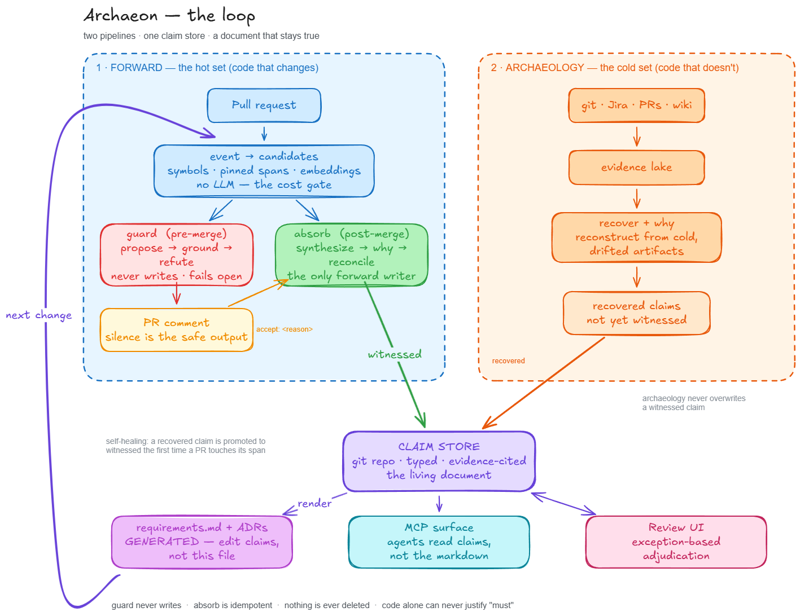
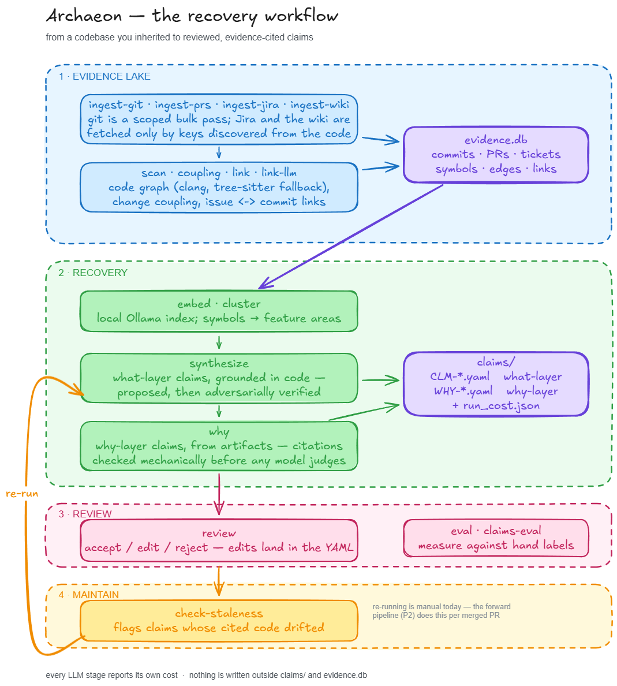

# Archaeon

**Recover the requirements and architecture decisions your codebase never wrote down — as
evidence-cited, reviewable claims rather than generated prose.**

---

## The problem

In long-lived projects, documentation drifts from the product until code is the only place the
truth lives. Understanding expected behavior — or the blast radius of a change — takes any
engineer a long time, and regression risk stays high. The failure runs the whole chain, from
product requirement to test.

The knowledge isn't gone, though. It's scattered across git history, Jira tickets, PR
discussions, code comments, and a wiki that stopped being true three years ago. Archaeon
reconstructs it from those sources, and then keeps it current as the code changes.

## What Archaeon does

**The claim is the atomic unit.** A claim is one testable statement about expected behavior or
structure — a state transition, timing budget, threshold, conditional rule, invariant — carrying
citations into the evidence that supports it. Specs and features are aggregations of claims.
Architecture decisions (retro-ADRs) are first-class siblings with the same evidence discipline.
Claims live as YAML in a git repo, so history, diffing, and review come free.

**Two layers, because they have different sources of truth.** *What-layer* claims — behavior,
structure, and the values of constraints — are grounded in code, which is their sole authority.
*Why-layer* claims — intent and rationale — cannot be settled by code: a 50 ms timeout tells you
the value but never whether it's a promise or an accident. Code yields a hypothesis; only
artifacts (the ticket saying "before winding damage") and human review can confirm it. A claim
left without corroborating artifacts is marked `code_inferred`, capped in confidence, and never
auto-verified.

**Review is adjudication, not reading.** A synthesis agent and an independent adversarial
verifier examine every claim. Agreement plus strong evidence means auto-verified, never shown to
a human. Disagreement or low confidence on a high-impact claim puts a card in a triage queue.
Experts arbitrate pre-argued positions in seconds rather than reading documents.

**One store, two surfaces.** The same claim set drives a human review UI and — once built — an
MCP server for AI agents, with verification status and confidence visible on both.

### The loop

Archaeon is designed as two pipelines over one claim store. Archaeology recovers claims from cold
code that hasn't changed; the forward pipeline keeps claims true as PRs land. Neither alone
produces a trustworthy document; together they do.



The right-hand pipeline is what exists today. The left-hand one is specified and next up — see
[Roadmap](#roadmap).

---

## Current state

Archaeon is **working research code**, not a product. It runs end to end on a real component and
has cleared its first precision gate. It has been exercised against exactly one private codebase,
so treat the numbers as encouraging rather than general.

| Area | State |
|---|---|
| **P0 — Evidence lake** | Shipped |
| Connectors: git (path-scoped, bot-filtered), PRs (via `gh`), Jira (key-driven), wiki (local export) | Shipped |
| C/C++ code graph: clang-first with tree-sitter fallback; unparsed regions recorded as gaps | Shipped |
| Change coupling, heuristic + cheap-LLM issue↔commit link recovery, precision/recall eval harness | Shipped |
| **P1 — Recovery + review** | Shipped |
| Retrieval + clustering (local Ollama embeddings, no hosted API, no torch) | Shipped |
| Commit-pinned evidence with blob-hash staleness detection | Shipped |
| Local review UI writing accept/edit/reject back into the claim YAML | Shipped |
| Why-layer Pass 2: span archaeology → artifact fetch → synthesis → citation grounding → adversarial verify | Shipped |
| Per-run LLM cost accounting, config-driven scoping (include/exclude globs) | Shipped |
| **P2 — Forward pipeline** | Specified, not built |
| **MCP surface** | Designed, not built |

**Gates.** The what-layer precision gate is **cleared**: 0.861 before adversarial verification
(target ≥ 0.85) and 1.000 after (target ≥ 0.95), at n=30 on a golden component. The corroborated
why-layer gate (≥ 0.80) has a written validation runbook but **has not been measured yet** — it is
the main open question in the project. The validation runs themselves were performed against a
private codebase and are not published here.

**Scale.** 38 test modules, 312 tests passing. Python 3.13+, SQLite evidence store, claims as
git-tracked YAML.

### Known limitations

- The git connector runs `git log --no-merges`, so a `pr→commit` link whose `dst_ref` is a true
  merge commit will not join to `commits.sha` and can dangle. Harmless for the P0 exit metric
  (which only reads `commit→ticket` links), but it must be fixed before the forward pipeline can
  pin against merge commits.
- Validated on C/C++ only. Other languages need a code-graph plugin.
- Cost figures are API-equivalent, not money charged — see [Cost accounting](#cost-accounting).

---

## Roadmap

- **P0 — Evidence lake** *(done)* — connectors, code graph, link recovery. Measurable output:
  link-recovery quality.
- **P1 — Recovery + review** *(done; one gate outstanding)* — full recovery pipeline and review
  UI. Gate: per-layer expert validation, what-layer ≥ 0.95 (cleared) and corroborated why-layer
  ≥ 0.80 (unmeasured).
- **P2 — Forward pipeline** *(next)* — the loop above. Decomposed into three sequenced tracks in
  the [forward pipeline spec](docs/superpowers/specs/2026-08-05-forward-pipeline-design.md):
  1. *Premise and foundations* — render requirements docs and MADR ADRs from the claim store,
     schema lineage (amend / supersede / retire), merge-commit pinning fix. Exits on a human
     verdict: would a reviewer recognize the rendered output as a requirements document?
  2. *Guardrail* — a pre-merge PR check that flags, at high precision, when a change contradicts
     a verified requirement. Never writes to the store; fails open. Gate: ≥ 0.90 precision on a
     replay backtest of merged PRs.
  3. *Absorb and ADRs* — post-merge reconciliation that keeps claims live, plus ADR detection
     from PR discussion. Gate: forward why-corroboration materially better than backward.
- **MCP surface** — expose claims to coding agents as a queryable protocol.
- **P3 — Rollout** — component by component.
- **P4 — Impact and effort** — `impact_of_requirement` and effort estimation grounded in
  claim↔code links plus historical ticket actuals. Last, because it depends on everything else.

Design intent, decisions, and rationale live in
[docs/superpowers/specs/2026-07-23-archaeon-design.md](docs/superpowers/specs/2026-07-23-archaeon-design.md).

---

## Usage

The pipeline runs in four stages. Each one writes to a durable artifact, so you can stop after
any of them, inspect what came out, and resume later — nothing is held in memory between
commands.



### Requirements

- Python **3.13+** and [uv](https://docs.astral.sh/uv/)
- [Ollama](https://ollama.com/) for local embeddings — `ollama pull qwen3-embedding:4b`
  (or `:0.6b` for CI / low-resource machines; dims match at 1024)
- The [GitHub CLI](https://cli.github.com/) (`gh`) for PR ingestion
- The [Claude CLI](https://claude.com/claude-code) for the LLM stages
- `compile_commands.json` for best C/C++ parse coverage — optional, falls back to tree-sitter

### Install and configure

```bash
uv sync
cp archaeon.example.toml archaeon.toml    # then edit paths, Jira, and PR settings
```

`archaeon.example.toml` documents every option. For a large component, start from
`archaeon.example.scoped.toml`, which narrows `path_prefixes` and excludes vendored and generated
code — that scoping matters more than it sounds, since sweeping in `thirdparty/` will dominate the
symbol graph and collapse clustering into meaningless mega-clusters.

Credentials:

```bash
export ARCHAEON_JIRA_TOKEN=...      # Jira Cloud API token (id.atlassian.com)
export ARCHAEON_JIRA_EMAIL=...      # the Atlassian account the token belongs to
gh auth login                       # PRs use the GitHub CLI's own auth — no token needed
claude login                        # or: export CLAUDE_CODE_OAUTH_TOKEN=...
```

Set the email as well as the token. Jira Cloud tokens authenticate via HTTP Basic as
`(email, token)`; omitting the email falls back to a bare bearer header, which Jira Cloud answers
with a **403 rather than a 401** — so it doesn't look like an auth problem at first glance. Omit
it only for setups that genuinely use bearer/OAuth, such as some Data Center configurations.

### Stage 1 — Build the evidence lake

Ingest is deliberately asymmetric: git is a scoped bulk pass because it is local, cheap, and
needed for change-coupling; Jira and the wiki are lazy fetchers driven by keys and terms
discovered from the code. Run these in order — `ingest-jira` fetches only the tickets referenced
by the commits and PRs the earlier steps found.

```bash
uv run archaeon ingest-git      # path-scoped, bot commits excluded
uv run archaeon ingest-prs      # the PRs containing this component's commits
uv run archaeon ingest-jira     # only tickets referenced by those commits/PRs
uv run archaeon ingest-wiki     # optional: a local Confluence HTML export
uv run archaeon scan            # build the code graph
uv run archaeon coupling        # change-coupling signal
uv run archaeon link            # heuristic issue<->commit link recovery
uv run archaeon link-llm        # cheap-LLM tail for the leftovers
uv run archaeon stats
```

### Stage 2 — Recover claims

The what-layer stands on code alone, so `synthesize` needs only `scan` to have run. The why-layer
needs the artifact ingest above.

```bash
uv run archaeon embed                                   # local embedding index
uv run archaeon cluster                                 # group symbols into feature areas
uv run archaeon synthesize --all-clusters --out claims  # what-layer, adversarially verified
uv run archaeon why --claims claims                     # why-layer Pass 2
```

`synthesize` writes one YAML claim per finding, each `machine_verified` or `contested`, plus
`run_cost.json`. `why` writes `WHY-*.yaml` beside the `CLM-*.yaml`, plus `why_cost.json`.

To scope to a single feature area instead of the whole component:

```bash
uv run archaeon synthesize --feature src/motor_ctrl/thermal/ --out claims
```

Every artifact excerpt a why-claim quotes is checked **mechanically** against the stored artifact
text before any model judges it, so a fabricated citation is dropped without spending an LLM call.
A claim whose citations all survive is marked `corroboration: corroborated`. A claim left with no
surviving artifact keeps its code hypothesis, is marked `code_inferred`, capped at confidence 0.4,
and is never auto-verified.

### Stage 3 — Review

```bash
uv run archaeon review --claims claims --port 8000      # then open http://127.0.0.1:8000/
```

Accept, edit, or reject with `a` / `e` / `r`. Edits are written straight back into the git-tracked
claim YAML, so review shows up as a normal diff.

### Stage 4 — Keep claims honest as code moves

```bash
uv run archaeon check-staleness --claims claims
```

Staleness is anchored to content hashes, not line numbers: it flags semantic edits to a cited
span, ignores cosmetic reflow, and survives line drift.

### Measuring quality

**Link recovery (the P0 exit metric).** Hand-label a sample of commits into `gold.csv`, where an
empty `ticket_key` means the commit genuinely has no ticket:

```
sha,ticket_key
abc123,EMB-42
def456,
```

```bash
uv run archaeon eval --gold gold.csv --method key_regex                       # commit messages only
uv run archaeon eval --gold gold.csv --method key_regex --method pr_inherited # + PR-level inheritance
uv run archaeon eval --gold gold.csv                                          # all methods, adds the llm tail
```

Commit-message keys alone only cover commits that name a ticket. Most tickets live on the PR —
title, body, or branch — and inherit to that PR's commits, which is the large lift. Run
`ingest-prs` and `link` before `eval`.

**Claim precision (the P1 gates).** Label each claim in a CSV (`claim_id,correct` with yes/no):

```bash
uv run archaeon claims-eval --claims claims --labels claim_labels.csv
```

A labels file containing only `WHY-` ids reports the why layer alone, even though the directory
holds both. When labeling why-claims, judge the *rationale*, not whether the cited artifact
exists — grounding already guarantees existence.

### Cost accounting

`synthesize`, `cluster`, and `why` report per-run LLM cost broken down by stage and model. Errored
calls (turn exhaustion, overload) are counted and flagged too, since they spend quota without
producing an answer.

These figures are **API-equivalent** — what the run would have cost on an API key — not money
charged, because the LLM stages run through the Claude CLI's own login (subscription/OAuth) rather
than an API key. `link-llm` deliberately hides `ANTHROPIC_API_KEY` and `ANTHROPIC_AUTH_TOKEN` from
the SDK to keep it that way.

One honest exception: if `CLAUDE_CODE_USE_BEDROCK`, `CLAUDE_CODE_USE_VERTEX`, or
`ANTHROPIC_BASE_URL` is set, the CLI may be routed somewhere that really does bill, which Archaeon
cannot see from the outside. Rather than claim the run was free, it reports the billing route as
unknown: `run_cost.json` carries `"billed": null`.

### Tests

```bash
uv run pytest
```

The review UI smoke test needs a Playwright browser: `playwright install chromium`.

---

## Documentation

| Document | What it covers |
|---|---|
| [Design specification](docs/superpowers/specs/2026-07-23-archaeon-design.md) | Problem, architecture, claim schema, phasing, risks, decisions |
| [Forward pipeline (P2)](docs/superpowers/specs/2026-08-05-forward-pipeline-design.md) | The PR-driven loop: guardrail, absorb, ADR detection, rendering |
| [P1 hardening overview](docs/superpowers/specs/2026-07-24-p1-hardening-overview.md) | How recovery was decomposed and validated |
| [P0 exit checklist](docs/p0-exit-checklist.md) · [P1 spike checklist](docs/p1-spike-exit-checklist.md) | The validation protocols |
| [Market research](docs/research/2026-07-23-market-research.md) | Landscape, and the lessons that constrain the design |

Specs and plans under `docs/superpowers/` use a fictional `motor-ctrl` component throughout,
matching [archaeon.example.toml](archaeon.example.toml). Where one cites a validation run performed
against a private codebase, it is marked *(internal validation run — not in this repo)*.

Both diagrams are committed as editable Excalidraw sources alongside their renders —
[archaeon-loop.excalidraw](docs/diagrams/archaeon-loop.excalidraw) for the conceptual loop and
[archaeon-workflow.excalidraw](docs/diagrams/archaeon-workflow.excalidraw) for the command
pipeline. Edit the source and re-export rather than patching the PNG.
